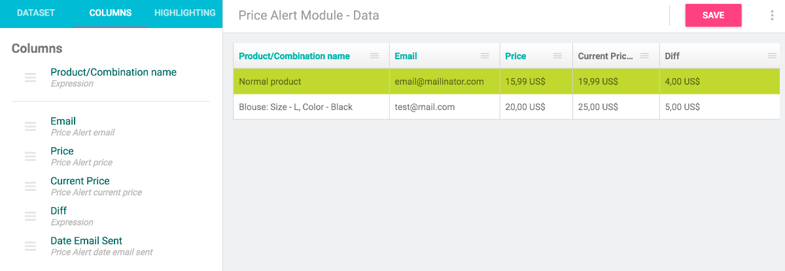

## Description
This free module will let your customers easily create price alerts on products and combinations. They will receive email when price drops below indicated threshold.

Not only is this a powerful incentive for them to return to your shop, but it also gives you interesting information - email addresses and expected price. You can use it to optimise your pricing strategy or for other marketing purposes.

## Features

- automatically sends email when price drops
- alerts can be created by anonymous visitors as well as registered customers
- supports product combinations - notification can be set for specific combination only
- supports multiple currencies
- easily change email template
- modern design

## Accessing data

Module itself doesn't have any functionality to export price alert data, but it is integrated with [DataKick module](https://www.getdatakick.com/) - your price alerts data will be available for creating lists, xml exports, inline editing and mass updates just as any regular record type. Minimal required version of datakick module is 2.1.0

